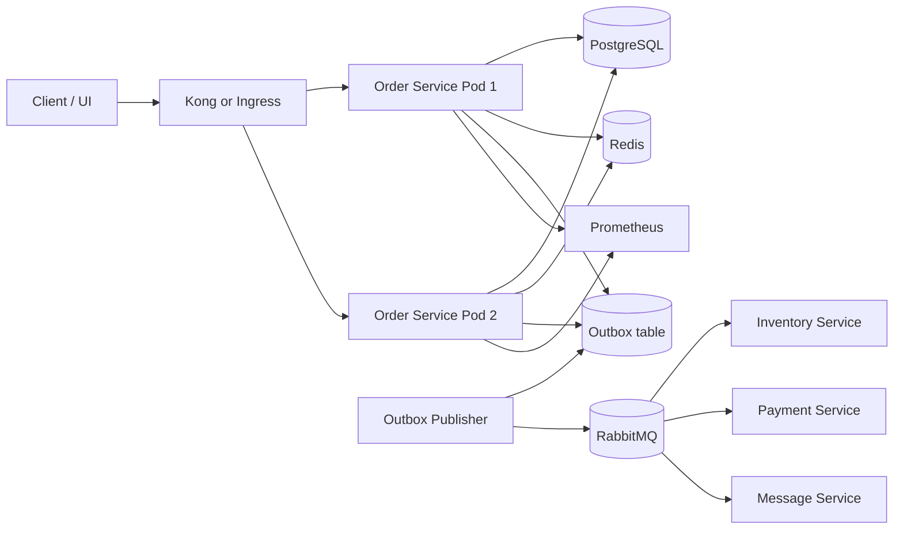
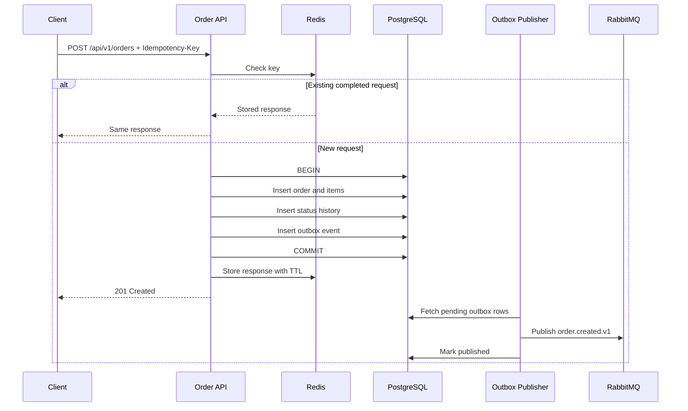
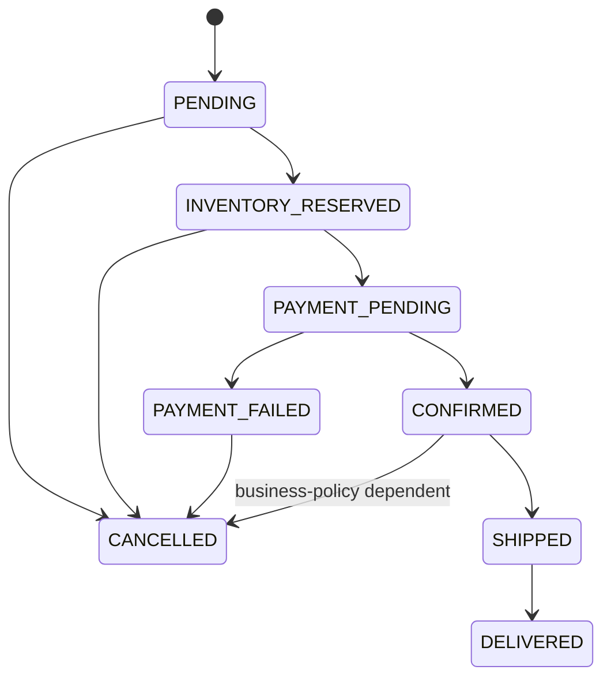

# Order Service — High-Level Design (HLD)

## 1. Purpose

The Order Service owns order creation, retrieval, status transitions, cancellation, and publication of order-domain events. The first measurable target is **10 requests per second (RPS)** on local Minikube with predictable latency, zero duplicate order creation, durable storage, and observable failure handling.

## 2. Current-state assessment

The uploaded service currently:

- exposes CRUD endpoints using Gin;
- keeps orders in a process-local `[]Order` slice;
- assigns IDs using `len(slice)+1`;
- publishes a text message directly to RabbitMQ at `localhost:5672`;
- ignores the RabbitMQ publishing error in the controller;
- has no persistent database, migrations, idempotency, health probes, metrics, Dockerfile, Kubernetes deployment, or load test;
- is unsafe under concurrent access because the slice is not protected.

This is suitable as a learning prototype, but not yet as a reliable 10-RPS service.

## 3. Scope

### In scope

- Create, get, list, update/cancel orders
- PostgreSQL as system of record
- Redis for idempotency and optional short-lived caching
- RabbitMQ for order-domain events
- Transactional outbox pattern
- Kubernetes deployment on Minikube
- Health, readiness, metrics, logs, and load testing

### Out of scope for the first milestone

- Full payment processing
- Warehouse allocation algorithms
- Shipment tracking
- Multi-region active-active deployment
- Exactly-once delivery across all services

## 4. Proposed architecture

## 5. Component responsibilities

| Component | Responsibility |
|---|---|
| Kong/Ingress | Routing, TLS termination, optional authentication and rate limiting |
| Order Service | Request validation, order rules, state transitions, persistence |
| PostgreSQL | Authoritative order data, order items, status history, outbox, idempotency fallback |
| Redis | Fast idempotency lookup, optional cache, distributed rate limiting |
| RabbitMQ | Asynchronous order events and decoupling from downstream services |
| Outbox Publisher | Reliably publishes committed database events to RabbitMQ |
| Prometheus/Grafana | Technical and business metrics |

## 6. Key flows

### Create order

### Read order

1. Validate order ID.
2. Optionally read a short-lived Redis cache.
3. Query PostgreSQL on cache miss.
4. Return `404` when absent.

## 7. Order lifecycle

State changes must be validated by one central transition function and persisted with optimistic locking using a `version` column.

## 8. Reliability design

- **Idempotency:** Require `Idempotency-Key` for create requests.
- **Transactions:** Persist order, items, status history, and outbox event in one transaction.
- **Optimistic locking:** Update with `WHERE id=$1 AND version=$2`.
- **Outbox retries:** Retry transient RabbitMQ failures with exponential backoff.
- **Dead-letter handling:** Move poison messages after a bounded retry count.
- **Timeouts:** Set HTTP, database, Redis, and RabbitMQ operation deadlines.
- **Graceful shutdown:** Stop new traffic, finish in-flight requests, close dependencies.

## 9. Capacity plan for 10 RPS

### Traffic assumptions

- Constant total request rate: 10 RPS
- Peak burst for test: 20 RPS for 60 seconds
- Mix: 30% writes, 65% reads, 5% updates/cancellations
- Average order: 3–5 items
- Initial dataset: up to 1 million orders

### Daily upper-bound volume

At a continuous 10 RPS, the service receives 864,000 requests/day. With a 30% write mix, that is approximately 259,200 created orders/day. This is a planning ceiling, not an expected business forecast.

### Starting deployment

| Item | Initial setting |
|---|---:|
| Replicas | 2 |
| CPU request/limit | 100m / 500m |
| Memory request/limit | 128Mi / 512Mi |
| DB max open connections per pod | 15 |
| DB max idle connections per pod | 5 |
| HTTP server read timeout | 5s |
| HTTP server write timeout | 10s |
| Request timeout | 3s |
| HPA target CPU | 60% |
| HPA min/max | 2 / 5 |

Two small Go pods should comfortably handle 10 RPS, but the result must be confirmed by load tests and database metrics.

## 10. SLOs and acceptance criteria

| Metric | Target |
|---|---|
| Sustained throughput | >= 10 RPS |
| Availability during test | >= 99.9% |
| Error rate | < 1% |
| P95 latency | < 300 ms |
| P99 latency | < 500 ms |
| Duplicate orders for repeated idempotency key | 0 |
| Lost committed events | 0 |
| Pod restarts during steady test | 0 |
| DB pool saturation | < 80% |

## 11. Security

- Do not store credentials in source control.
- Use Kubernetes Secrets or External Secrets.
- Run containers as non-root with a read-only root filesystem where practical.
- Validate JSON payload size and field limits.
- Apply authentication at Kong/Ingress and authorization inside the service where needed.
- Encrypt traffic outside the cluster and use TLS for managed databases/brokers.
- Use NetworkPolicies to restrict service-to-service access.

## 12. Observability

Expose:

- `/health/live`
- `/health/ready`
- `/metrics`

Minimum metrics:

- HTTP request count, duration, and status
- Orders created/cancelled/failed
- DB pool open/in-use/wait count
- Redis errors and latency
- Outbox pending count and oldest age
- RabbitMQ publish successes/failures/retries
- Go goroutines, heap, GC, CPU

## 13. Deployment strategy

1. Local Docker Compose for PostgreSQL, Redis, and RabbitMQ.
2. Run migrations.
3. Run service locally and execute smoke tests.
4. Build image inside Minikube or push to a registry.
5. Deploy ConfigMap, Secret, Deployment, Service, HPA, and PDB.
6. Run k6 at 1 RPS, then 5 RPS, then 10 RPS.
7. Observe latency, errors, resource usage, and DB pool.
8. Tune only after measurement.
