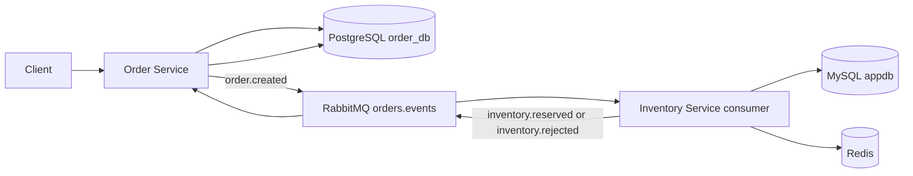

# Inventory Service HLD

## Purpose
Inventory Service owns stock availability and reservation state. It preserves the existing invoice/database-provisioning endpoints, and adds a separate GORM-based stock domain used by Order Service.

## Components
- Gin API on port `8914`
- MySQL 8.4
- GORM for `stock_items` and `reservations`
- RabbitMQ topic exchange `orders.events`
- Redis for event deduplication and short-lived reservation state

## Event flow

## Availability
RabbitMQ queues are durable and messages are persistent. Consumers acknowledge only after database work and result publication succeed. Redis `SETNX` prevents duplicate processing of the same event ID. The `reservations.order_id` unique index provides a second idempotency boundary.

## Data ownership
- Order Service owns orders and order status.
- Inventory Service owns stock and reservations.
- Neither service writes directly to the other service's database.
