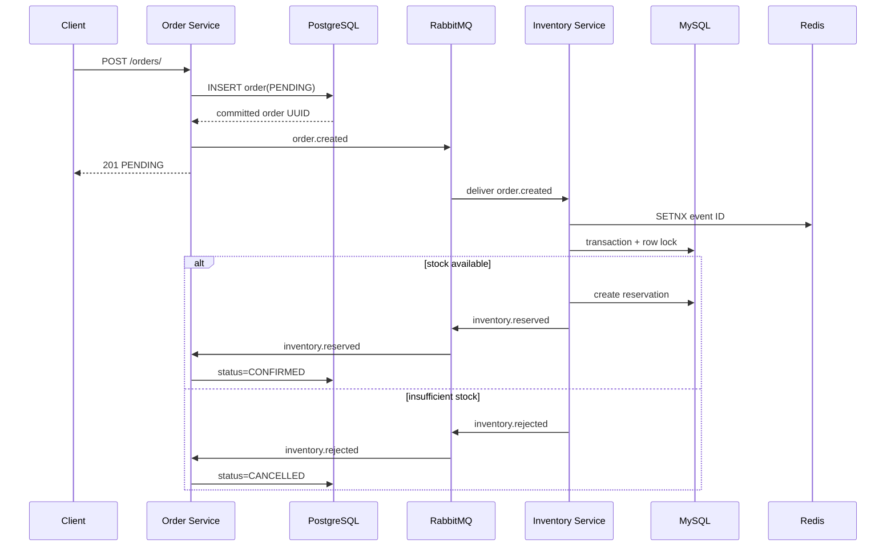

# Order and Inventory Service Communication

## Pattern
Communication is asynchronous through RabbitMQ. Order creation does not call Inventory Service synchronously.

## Exchanges and routing keys
- Topic exchange: `orders.events`
- `order.created`: produced by Order Service, consumed by Inventory Service
- `inventory.reserved`: produced by Inventory Service, consumed by Order Service
- `inventory.rejected`: produced by Inventory Service, consumed by Order Service

## Sequence

## Delivery semantics
RabbitMQ provides at-least-once delivery. Exactly-once behavior is approximated through:
- event IDs
- Redis `SETNX` deduplication
- unique reservation per `order_id`
- idempotency key on order creation

## Failure handling
- Consumer parsing failure: reject without requeue.
- Temporary DB or publish failure: nack and requeue.
- Duplicate delivery: acknowledge after Redis or database idempotency check.
- RabbitMQ unavailable during order creation: order remains committed but event publication is currently best-effort. Production next step is a PostgreSQL outbox publisher.

## Redis usage
- Order Service: deduplicates inventory result events and can cache order reads.
- Inventory Service: deduplicates `order.created` events and can cache reservation status.
Redis is not the source of truth.

## Important next step
For guaranteed event publication, wire the existing `outbox_events` table into an outbox worker. This removes the commit/publish gap in the current controller-level publish.
